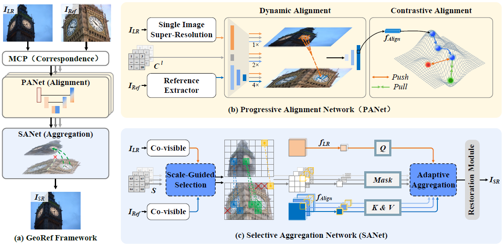
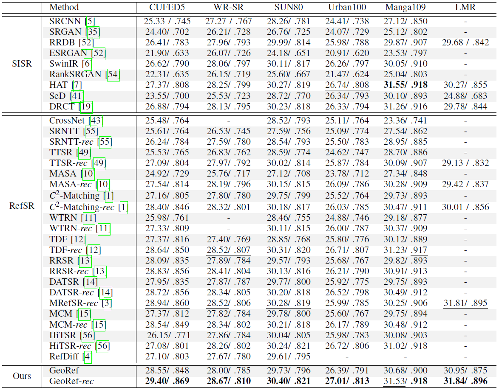
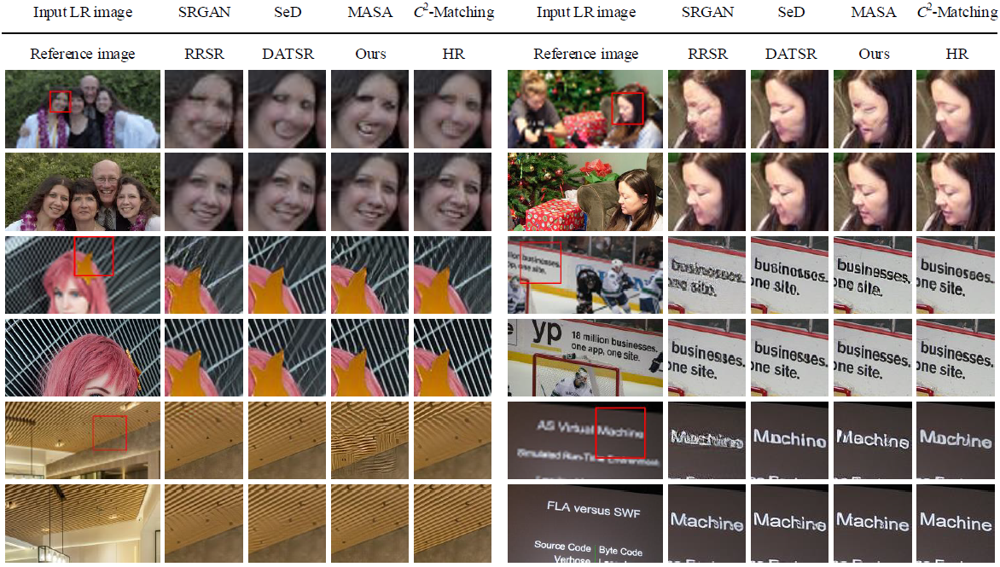
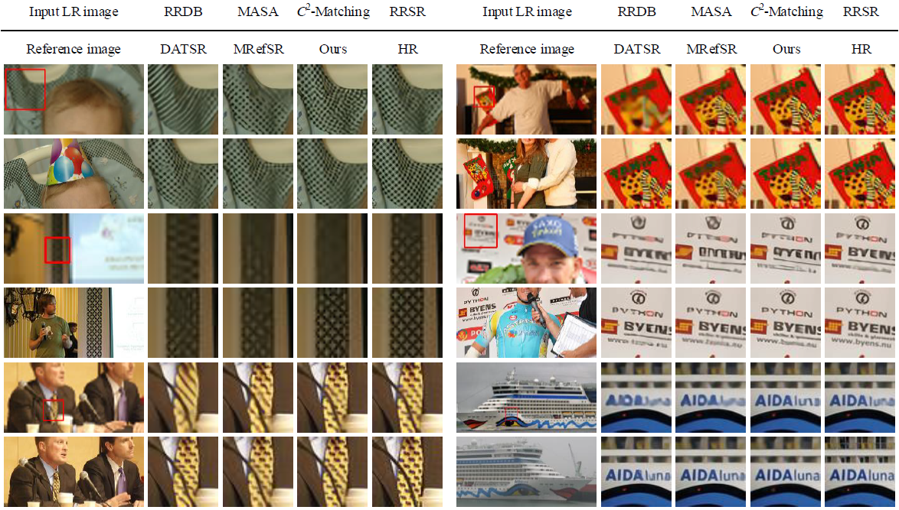

# Reference-Based Super-Resolution with Geometry-Aware Transfer

Reference-based super-resolution (RefSR) leverages an additional high-resolution (HR) image as supplementary information to super-resolve a low-resolution (LR) image, which results in superior outcomes compared to single-image super-resolution (SISR). Most existing RefSR methods employ a simple LR-oriented pair-wise paradigm to borrow realistic reference textures. However, these methods still struggle with well-matched reference texture transfer, due to the appearance distortion gap and disproportion gap resulting from geometric transformations between the input and the reference images. This motivates us to propose a novel RefSR framework with geometry-aware transfer, termed **GeoRef**, with the goal of transferring  highly consistent reference textures across geometric transformations. For the distortion gap, we propose a progressive alignment network that supervises the alignment using more detailed SISR and HR images, guiding the network to refine reference textures to original details while forcing results far from incongruous or smooth artifacts. For the disproportion gap, we design a selective aggregation network, which permits the adaptive transfer of multiple correlated references according to the object scale ratio between the two images, thus compensating for more valuable information. Additionally, our GeoRef framework enables seamless integration with multiple recent leading RefSR methods to continuously enhance their performance. Extensive experiments on six benchmark datasets demonstrate that our GeoRef framework achieves superior performance over state-of-the-art methods on both quantitative and qualitative evaluations.



## Dependency and Installation

- Ubuntu 20.04
- Python 3.8
- PyTorch 1.11.0
- CUDA 11.3

1. Create Conda Environment

   ````
   conda create --name georef python=3.8
   conda activate georef

2. Install MMCV

   ````
   pip install -U openmim
   mim install mmcv

3. Install Dependencies

   ```
   cd GeoRef
   conda install pytorch=1.11.0 torchvision cudatoolkit=11.3 -c pytorch
   python setup.py develop
   cd basicsr/archs/ddf
   python setup.py build develop
   ```

## Dataset Preparation

- Train Set: [CUFED](https://github.com/ZZUTK/SRNTT) Dataset
- Test Sets:  CUFED5 Dataset, WR-SR Dataset, LMR Dataset, SUN80 Dataset

## Training

### Train on the proposed GeoRef
```
python basicsr/test.py -opt options/train/stage1_alignment_SISR_oriented.yml
python basicsr/test.py -opt options/train/stage2_alignment_HR_oriented.yml
```
```
python basicsr/test.py -opt options/train/stage3_aggregation_mse.yml
python basicsr/test.py -opt options/train/stage3_aggregation_gan.yml
```

The results will be saved in ./experiments

## Inference

```
python basicsr/test.py -opt georef_gan.yml
python basicsr/test.py -opt georef_mse.yml
```
The results will be saved in ./result

## Results

### Quantitative Comparison



### Qualitative Comparison





## Acknowledgement

We appreciate the great work of [C2-Matching](https://github.com/yumingj/C2-Matching), [MRefSR](https://github.com/wdmwhh/MRefSR), etc. Please refer to the original repo for more usage and documents. The complete code will be released later.


