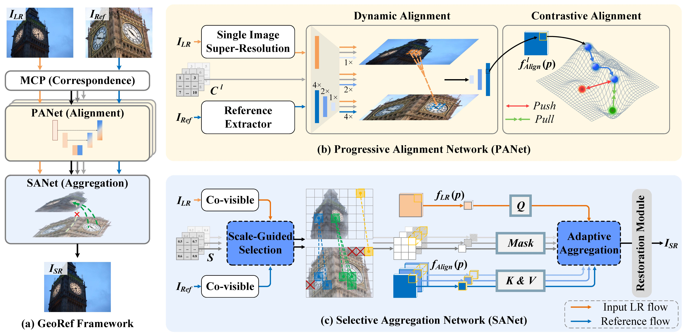
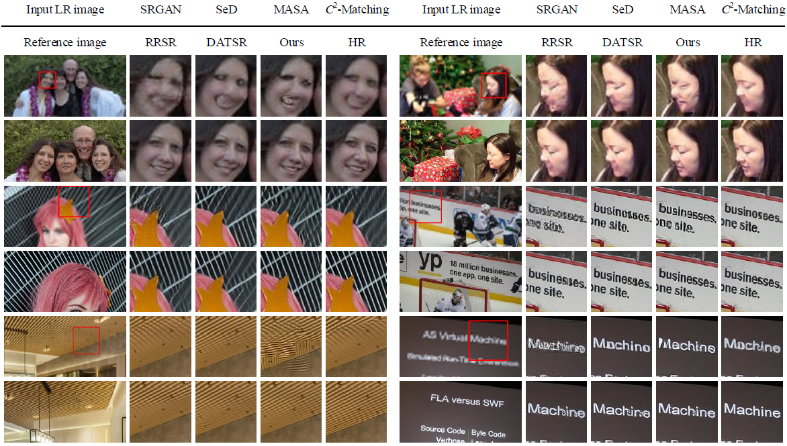

# Reference-Based Super-Resolution with Geometry-Aware Transfer (GeoRef)

### Brief

This is the implementation of paper: Reference-Based Super-Resolution with Geometry-Aware Transfer

---

### Overview Framework



---

### Dependency and Installation

- Ubuntu 20.04
- Python 3.8
- PyTorch 1.11.0
- CUDA 11.3

1. Create Conda Environment

   ````
   conda create --name georef python=3.8
   conda activate georef

2. Install MMCV

   ````
   pip install -U openmim
   mim install mmcv

3. Install Dependencies

   ```
   cd GeoRef
   conda install pytorch=1.11.0 torchvision cudatoolkit=11.3 -c pytorch
   python setup.py develop
   cd basicsr/archs/ddf
   python setup.py build develop
   ```

4. Dependent Models
   - [RRDB](https://github.com/xinntao/ESRGAN) (for single image super-resolution)
   - [Adamatcher](https://github.com/AbyssGaze/AdaMatcher) (for co-visible segementation)

### Dataset Preparation

- Train Set: [CUFED5](https://github.com/ZZUTK/SRNTT) Dataset
- Test Sets:  [CUFED5](https://github.com/ZZUTK/SRNTT) Dataset, [WR-SR](https://github.com/yumingj/C2-Matching) Dataset, [LMR](https://github.com/wdmwhh/MRefSR) Dataset

---

### Training

```
python basicsr/test.py -opt options/train/stage1_alignment_SISR_oriented.yml
python basicsr/test.py -opt options/train/stage2_alignment_HR_oriented.yml
```
```
python basicsr/test.py -opt options/train/stage3_aggregation_mse.yml
python basicsr/test.py -opt options/train/stage3_aggregation_gan.yml
```

The results will be saved in ./experiments

### Inference

```
python basicsr/test.py -opt georef_gan.yml
python basicsr/test.py -opt georef_mse.yml
```
The results will be saved in ./result

---

### Results

#### Quantitative Comparison


#### Qualitative Comparison




---

#### Acknowledgement

We appreciate the great work of [*C*2 -Matching](https://github.com/yumingj/C2-Matching), [MRefSR](https://github.com/wdmwhh/MRefSR), [DATSR](https://github.com/caojiezhang/DATSR), RRSR, [MASA](https://github.com/dvlab-research/MASA-SR), [RefDiff](https://github.com/dongrunmin/RefDiff), etc. Please refer to the original repo for more usage and documents. 

#### Contact

Feel free to contact me if there is any question. (Ke Zhang: [itzhangke@stu.ouc.edu.cn](mailto:itzhangke@stu.ouc.edu.cn), Lei Huang: [huangl@ouc.edu.cn](mailto:huangl@ouc.edu.cn))
Note: The source code is currently incomplete and will be fully released once the manuscript is accepted by the journal.


